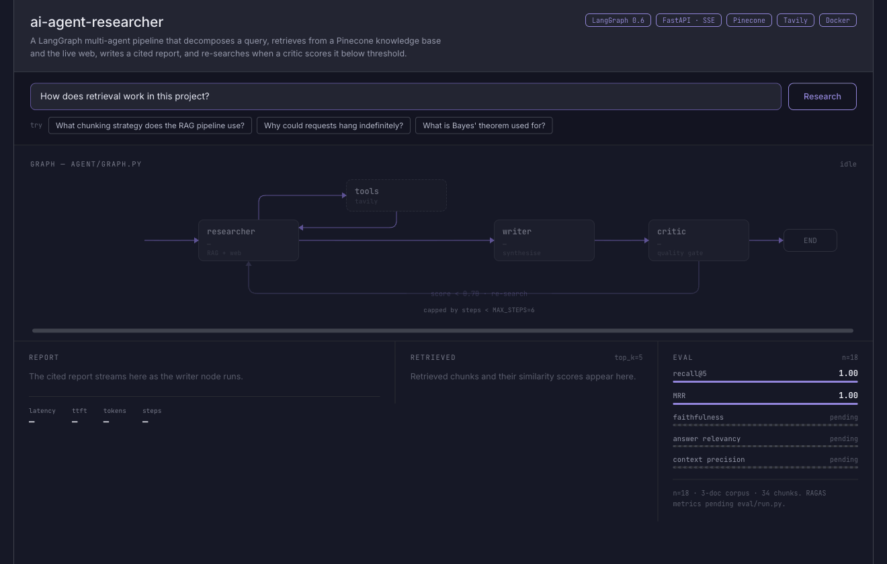

# AI Agent Researcher

An autonomous multi-agent research assistant that decomposes a query into sub-tasks, retrieves relevant context from a vector knowledge base, searches the live web, and synthesises a cited report. Built with LangGraph, FastAPI, and a RAG pipeline backed by Pinecone.

---

## Demo



A real run, unedited. Each node advances from pending to running to done off the live SSE
stream, reporting what it actually did — sub-queries decomposed, chunks retrieved, tokens
streamed, and the critic's score. The dimmed edge beneath the graph is the re-search loop,
which lights up when the critic scores below `0.70`.

Start it locally and open <http://localhost:8000>:

```bash
PYTHONPATH=. uv run uvicorn api.routes:app --reload
```

---

## How it works

A supervisor agent receives the user's query and breaks it into sub-tasks. Worker agents retrieve context from the internal knowledge base (via RAG) and the live web (via Tavily). A synthesis agent assembles the retrieved context into a structured report. A critique agent checks the output for gaps and triggers a re-search loop if confidence is low. The final answer streams back to the client token by token.

> **Roadmap:** retrieval is currently pure semantic (dense vector) search. An eval suite (`eval/`) now measures retrieval, answer quality, and cost/latency against a golden set; hybrid search (BM25 + semantic) and score-sorted merging are the measured follow-ons.

```
User query
    └── Supervisor (decomposes + routes)
            ├── Researcher (RAG + web search)
            ├── Writer (synthesis)
            └── Critic (quality gate + re-search loop)
```

---

## Tech stack

| Layer | Technology |
|---|---|
| Agent orchestration | LangGraph 0.6.x |
| LLM | OpenAI gpt-4o-mini via OpenAI SDK |
| Retrieval | RAG over Pinecone vector DB |
| Embeddings | Pinecone integrated inference, `llama-text-embed-v2` (computed server-side, not a separate OpenAI call) |
| Web search | Tavily API (via a plain LangChain `@tool`, not MCP) |
| API server | FastAPI + uvicorn |
| Package manager | uv |
| Python | 3.12 |

---

## Project structure

```
ai-agent-researcher/
├── main.py                  # Entry point — starts FastAPI, compiles agent graph on startup
├── pyproject.toml           # Dependencies and project metadata
├── uv.lock                  # Pinned dependency versions (commit this)
├── .env                     # Secret keys — never commit
├── .python-version          # Pins Python 3.12
│
├── agent/
│   ├── __init__.py
│   ├── graph.py             # LangGraph StateGraph definition and compile()
│   ├── state.py             # AgentState TypedDict — shared memory across nodes
│   ├── nodes.py             # Node functions: supervisor, researcher, writer, critic
│   └── tools.py             # @tool definitions callable by the LLM
│
├── rag/
│   ├── __init__.py
│   ├── ingest.py            # Load documents, chunk, upsert to Pinecone (offline)
│   ├── embedder.py          # Shared config constants (model, field names, namespace)
│   └── retriever.py         # Semantic search against the vector index (online)
│
├── vectorstore/
│   ├── __init__.py
│   └── client.py            # Pinecone client singleton, auto-creates the index
│
├── api/
│   ├── __init__.py
│   ├── routes.py            # FastAPI app: /research and /research/stream endpoints
│   ├── schemas.py           # Pydantic request/response models
│   └── streaming.py         # SSE event generator for /research/stream
│
├── eval/
│   ├── __init__.py
│   ├── golden_set.json      # Hand-curated query/expected_sources/reference_answer set
│   ├── metrics.py           # Pure retrieval metrics: hit rate@k, recall@k, MRR
│   ├── judges.py            # LLM-judged answer quality (gpt-4o judge)
│   ├── generate_corpus.py   # Renders eval/corpus_src/*.md to docs/corpus/*.pdf
│   ├── corpus_src/          # Fictional-company corpus source documents
│   └── run.py               # Eval suite CLI entry point
│
└── tests/
    ├── test_graph.py
    ├── test_ingest.py
    ├── test_nodes.py
    ├── test_retriever.py
    └── test_routes.py
```

---

## Prerequisites

- [uv](https://docs.astral.sh/uv/) — install with `curl -LsSf https://astral.sh/uv/install.sh | sh`
- OpenAI API key — [platform.openai.com](https://platform.openai.com)
- Pinecone API key — [pinecone.io](https://pinecone.io)
- Tavily API key — [tavily.com](https://tavily.com)

---

## Setup

**1. Clone and enter the project**

```bash
git clone https://github.com/your-username/ai-agent-researcher.git
cd ai-agent-researcher
```

**2. Install dependencies**

uv handles the virtual environment and Python version automatically.

```bash
uv sync
```

**3. Configure environment variables**

```bash
cp .env.example .env
```

Open `.env` and fill in your keys:

```env
OPENAI_API_KEY=sk-...
PINECONE_API_KEY=...
PINECONE_INDEX=llama-text-embed-v2-index
TAVILY_API_KEY=...
APP_ENV=development
```

**4. Index creation is automatic**

`vectorstore/client.py`'s `ensure_index()` creates the index on first use via Pinecone integrated inference (`llama-text-embed-v2`, dimension 1024, cosine similarity) if it doesn't already exist — no manual console step needed.

**5. Ingest your knowledge base** (optional — skip to use web search only)

Place documents in `docs/corpus/` then run:

```bash
uv run python -m rag.ingest docs/corpus/ --reset
```

`--reset` clears the namespace first so removed documents don't linger in the index.

**6. Start the server**

```bash
PYTHONPATH=. uv run uvicorn api.routes:app --reload
```

The API is now available at `http://localhost:8000`. Interactive docs at `http://localhost:8000/docs`.

---

## Usage

**Send a research query**

```bash
curl -X POST http://localhost:8000/research \
  -H "Content-Type: application/json" \
  -d '{"query": "What are the latest advances in long-context LLMs?"}'
```

**Stream the response**

```bash
curl -X POST http://localhost:8000/research/stream \
  -H "Content-Type: application/json" \
  -H "Accept: text/event-stream" \
  -d '{"query": "Compare transformer and state space model architectures"}' \
  --no-buffer
```

There is no runtime document-upload endpoint — ingestion is the offline `python -m rag.ingest <docs_dir>` step above.


## Agent architecture

The graph is built in `agent/graph.py` using LangGraph's `StateGraph`. All nodes communicate via a shared `AgentState` TypedDict defined in `agent/state.py`.

```
Entry
  └── supervisor         Decomposes query, sets routing decision in state["next"]
        ├── researcher   Runs RAG retrieval + Tavily web search, populates state["retrieved_docs"]
        └── writer       Assembles retrieved context into a cited report
              └── critic Scores output quality; routes back to researcher if score < threshold
                    └── END
```

Conditional routing is handled by a single `route()` function that reads `state["next"]` — the supervisor writes this field to direct the graph at each step.

---

## RAG pipeline

Ingestion and retrieval are fully decoupled. Run `ingest.py` independently on a schedule or on demand; the agent's `retriever.py` only ever reads from the index.

**Chunking strategy:** `RecursiveCharacterTextSplitter` with `chunk_size=512` and `chunk_overlap=50`. Each chunk is labelled with its source filename in metadata so the writer node can cite it.

**Retrieval:** Semantic similarity search using the embedded user query against the Pinecone index. Top-k results are returned with source metadata and passed directly into the writer node's context window.

---

## Evaluation

`eval/` holds a quality-evaluation suite, separate from the unit-tested `tests/` suite since it needs live Pinecone + live OpenAI calls:

- `eval/golden_set.json` — 25 hand-curated queries (including cross-document and deliberately unanswerable items) with expected source documents and reference answers.
- `eval/metrics.py` — pure retrieval metrics: hit rate@k, recall@k, MRR.
- `eval/judges.py` — hand-rolled LLM judges (faithfulness, answer relevancy, context precision, abstention), judged by `gpt-4o` to avoid self-preference bias with the agent's `gpt-4o-mini`.
- `eval/run.py` — runs a retrieval-only pass and a full end-to-end pass against the live agent graph, reporting per-cluster scores plus steps, tokens, cost, and latency.
- `eval/corpus_src/*.md` + `eval/generate_corpus.py` — a fictional-company document corpus rendered to `docs/corpus/*.pdf`, so scores measure the pipeline rather than the model's parametric knowledge. Every figure traces to `docs/corpus_facts.md`.

Run with:

```bash
PYTHONPATH=. uv run python -m eval.run
PYTHONPATH=. uv run python -m eval.run --sequential   # clean latency figures
```

See `docs/superpowers/specs/2026-07-28-rag-eval-corpus-design.md` for the full design.

---

## Development

**Add a dependency**

```bash
uv add <package-name>
```

**Run tests**

```bash
PYTHONPATH=. uv run pytest tests/ -v
```

**Format and lint**

```bash
uv run ruff format .
uv run ruff check .
```

---

## Deployment

The project is containerised with Docker. The image targets Python 3.12-slim and copies only the application source, keeping the image small.

```bash
docker build -t ai-agent-researcher .
docker run -p 8000:8000 --env-file .env ai-agent-researcher
```

For production, set `APP_ENV=production` and mount secrets via your cloud provider's secret manager rather than a `.env` file.

---

## Acknowledgements

Built with [LangGraph](https://github.com/langchain-ai/langgraph), [FastAPI](https://fastapi.tiangolo.com), [Pinecone](https://pinecone.io), and [Tavily](https://tavily.com).